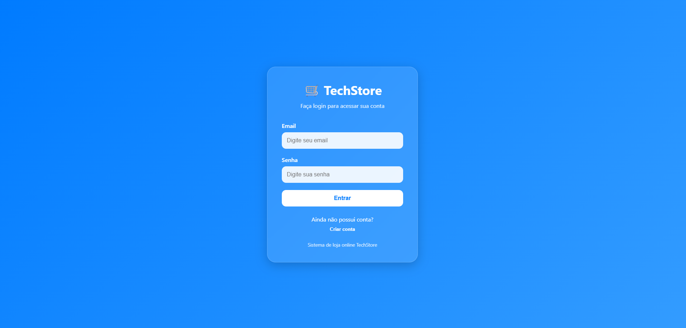
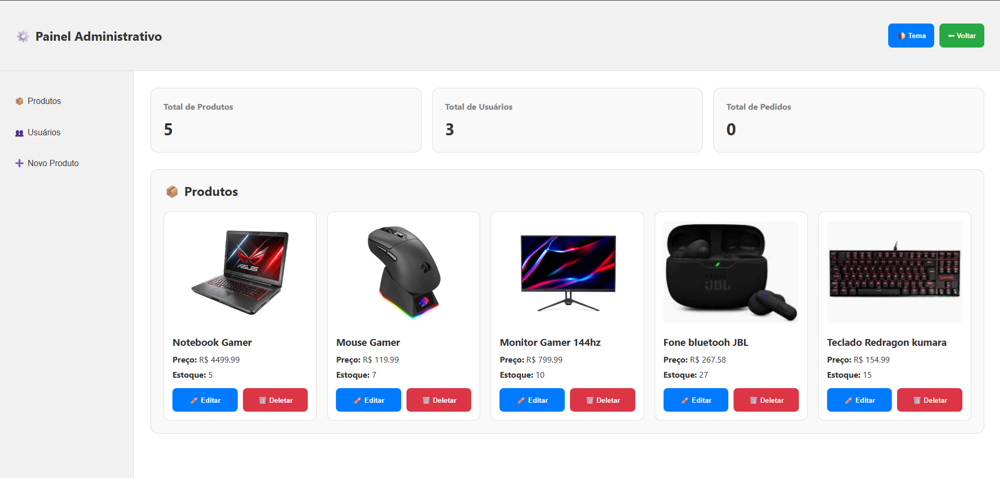

# Sistema de Controle - PIM Faculdade

Projeto desenvolvido para apresentação do PIM da faculdade.

## Tecnologias usadas
- HTML (Frontend)
- CSS (Frontend)
- JavaScript (Frontend)
- C# (Backend)
- SQL Server 2022 (Banco de dados)

## Funcionalidades
- Cadastro de usuários
- Controle de estoque
- Opção de clientes e admin
- Adição, remoção e edição de itens (admin)
- Sistema de carrinho de compras
- Sistema de página de favoritos

## Objetivo
Sistema criado para automatizar processos empresariais.

## Autor
Arthur Granja

## Preview do Sistema

### Tela Principal

### Login

### Itens Admin

## Como executar

1. Clone o repositório
2. Abra o projeto no Visual Studio
3. Configure o banco SQL Server
4. Execute o projeto
